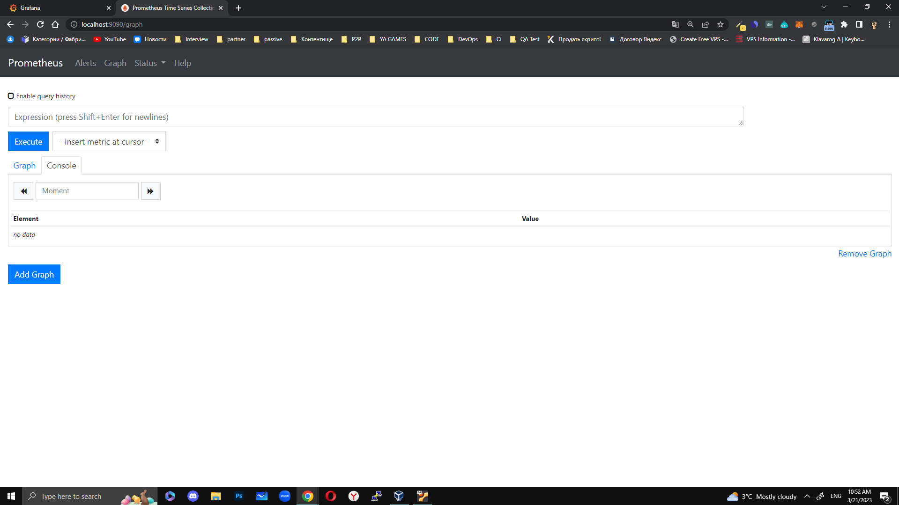
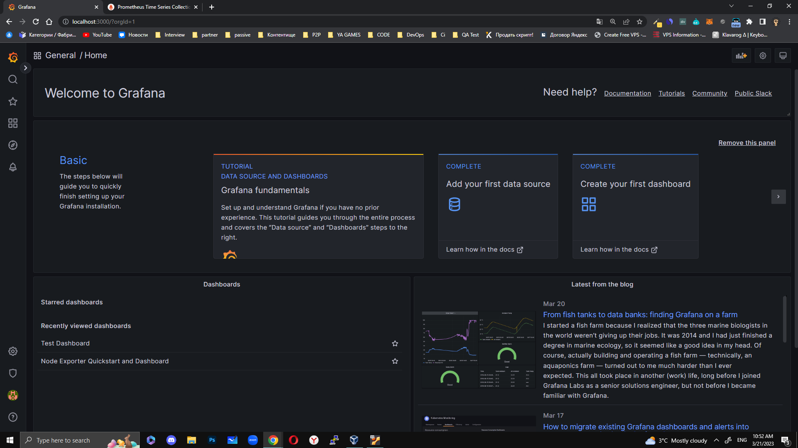
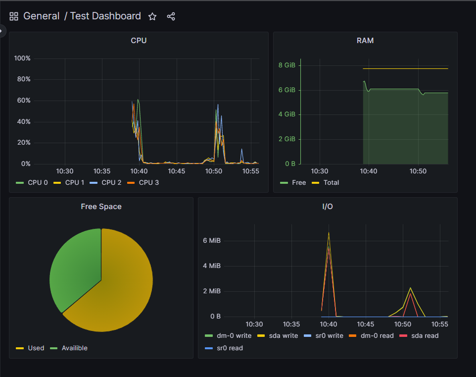
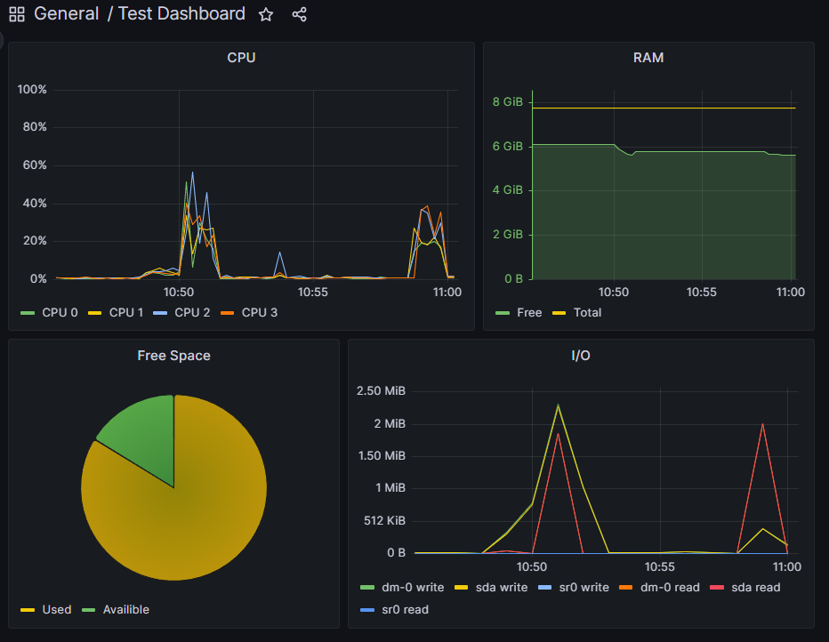
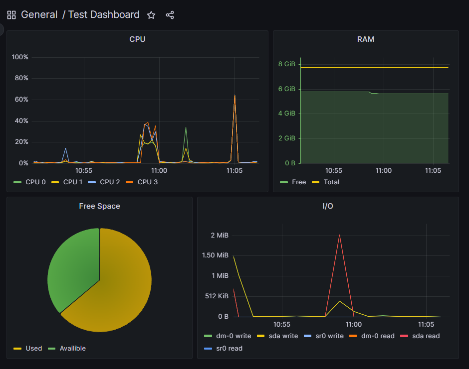

# Prometheus и Grafana

## Устанока Node Exporter:

1. wget https://github.com/prometheus/node_exporter/releases/download/v*/node_exporter-*.*-amd64.tar.gz
2. tar xvfz node_exporter-*.*amd64.tar.gz
3. cd node_exporter-*.*amd64
4. ./node_exporter
5. пробросить порт 9100

## Установка Prometheus:

1. sudo apt install prometheus
2. sudo systemctl start prometheus
3. пробросить порт 9090 из виртуальной машины
4. добавить в конфиг /etc/prometheus/prometheus.yml цель node-exporter

## Установка Grafana:

1. sudo apt-get install -y adduser libfontconfig1  
2. wget [https://dl.grafana.com/enterprise/release/grafana-enterprise_9.4.3_amd64.deb](https://dl.grafana.com/enterprise/release/grafana-enterprise_9.4.3_amd64.deb) 
3. sudo dpkg -i grafana-enterprise_9.4.3_amd64.deb
4. пробросить порт 3000

## Получили доступ с локальной машины

Prometheus

Grafana

## Настроили Dashboard

Grafana Dashboard

## После запуска скрипта из p.2

Grafana Dashboard

## После запуска stress -c 2 -i 1 -m 1 --vm-bytes 32M -t 10s

