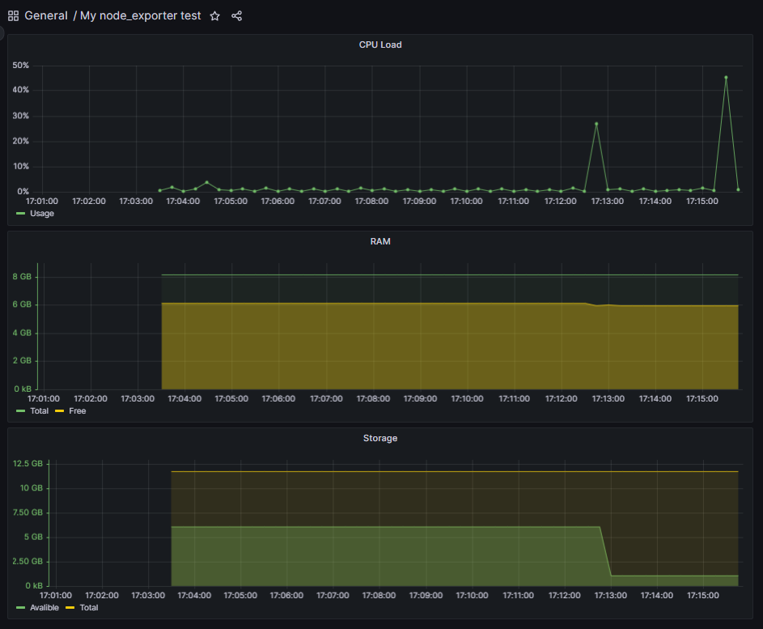

# Свой node_exporter

## Установка и настройка nginx:

1. sudo apt-get install nginx
2. /etc/nginx/nginx.conf 

Конфиг nginx

## Сам скрипт: main.sh и metrics.sh

## Добавляем скрипт как сервис:

my_node_exporter.service

[main.sh](http://main.sh) и [metrics.sh](http://metrics.sh) в /usr/bin/

my_node_exporter.service в /etc/systemd/system/

Запускаем сервис как обычно: sudo systemctl start my_node_exporter.service

Profit =)

## Настраиваем конфиг prometheus:

prometheus.yml

## Новый дашборд:

Grafana Dashboard

## ****После запуска скрипта из p.2****

Grafana Dashboard

## После запуска stress -c 2 -i 1 -m 1 --vm-bytes 32M -t 10s

Grafana Dashboard